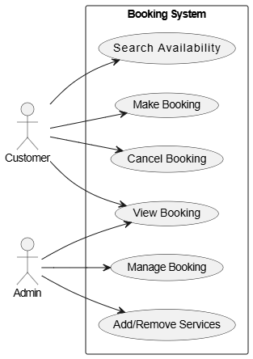

# Requirement Analysis in Software Developnment

## Introduction

This repository is dedicated to exploring the process of requirement analysis in software development. It contains documentation, examples, and resources to help understand how to gather, analyze, and manage software requirements effectively. The goal is to provide insights into best practices that ensure successful project planning and execution.

## What is Requirement Analysis?

Requirement Analysis is a crucial phase in the Software Development Life Cycle (SDLC) that involves identifying, gathering, and analyzing the needs and expectations of stakeholders for a software application. This process ensures that the final software product meets the intended business goals and user needs.

During this phase, software engineers, business analysts, and stakeholders collaborate to define clear, detailed, and unambiguous requirements. These requirements form the foundation for design, development, testing, and deployment activities.

### Importance of Requirement Analysis in SDLC

1. **Clarity and Focus:** It helps all stakeholders clearly understand what the system should do, reducing the chances of miscommunication or incorrect assumptions.
2. **Prevents Scope Creep:** Well-documented requirements help prevent uncontrolled changes during development, keeping the project on track and within budget.
3. **Saves Time and Cost:** Identifying issues early in the SDLC is significantly less expensive than fixing them later during testing or post-deployment.
4. **Improves Quality:** A solid requirement analysis process contributes to building software that is more aligned with user expectations and business objectives.
5. **Enhances Planning:** Accurate requirements provide the necessary information to plan resources, timelines, and costs effectively.

By investing time in thorough requirement analysis, software teams can deliver more successful and sustainable solutions that fulfill user needs and perform reliably in real-world environments.

## Why is Requirement Analysis Important?

Requirement Analysis is essential for the success of any software development project. The table below highlights key reasons why it is critical in the Software Development Life Cycle (SDLC):

| **Reason**                         | **Description**                                                                                  |
|-----------------------------------|--------------------------------------------------------------------------------------------------|
| **Prevents Costly Errors**        | Identifying issues early helps avoid expensive fixes during development or after deployment.    |
| **Enhances Communication**        | Facilitates clear communication between stakeholders and developers, reducing misunderstandings.|
| **Guides Project Planning**       | Helps in accurate estimation of time, cost, and resources, ensuring smooth project execution.    |

## Key Activities in Requirement Analysis

Requirement Analysis involves several structured activities to ensure that the software requirements are complete, clear, and aligned with stakeholder expectations. Below are the five key activities:

- **Requirement Gathering**
  - This is the initial step where information is collected from stakeholders, users, and other sources.
  - Techniques include interviews, surveys, questionnaires, and studying existing systems or documentation.

- **Requirement Elicitation**
  - Elicitation goes beyond gathering—it's about drawing out and discovering hidden or implicit needs.
  - It involves active interaction with stakeholders to clarify and understand their expectations and constraints.

- **Requirement Documentation**
  - This step involves formally recording all the gathered and elicited requirements in a structured format.
  - Common outputs include Software Requirements Specifications (SRS), use cases, and user stories.

- **Requirement Analysis and Modeling**
  - At this stage, the requirements are analyzed to detect conflicts, overlaps, or inconsistencies.
  - Modeling techniques such as data flow diagrams (DFDs), entity-relationship diagrams (ERDs), or UML are used to represent requirements visually.

- **Requirement Validation**
  - The final activity ensures that the documented requirements are complete, correct, feasible, and testable.
  - It involves reviews, walkthroughs, and feedback sessions with stakeholders to gain formal approval.

Each of these activities is essential for building a strong foundation that supports the design, development, and deployment of a successful software product.

## Types of Requirements

In software development, requirements are typically categorized into **Functional** and **Non-functional** types. The table below provides a comparison along with real-world examples from a hotel booking management system like Airbnb, OYO, or Booking.com.

| Requirement Type       | Description                                                                 | Example in Hotel Booking System                                                                 |
|------------------------|-----------------------------------------------------------------------------|--------------------------------------------------------------------------------------------------|
| **Functional**         | Describes what the system should do—its features and operations.            | - User registration and login   - Search hotels by location and date   - Book and cancel rooms   - View and manage bookings   - Process payments through third-party services |
| **Non-functional**     | Describes how the system should behave—its qualities and constraints.       | - Handle high traffic using load balancers and microservices   - Fast API response time via Redis and CDN   - Secure data transmission (HTTPS, authentication)   - Scalable data storage with Cassandra   - High system uptime and fault tolerance |

Functional requirements focus on **features**, while non-functional requirements focus on **performance, security, and reliability**. Both are essential for building a robust and user-friendly system.

## Use Case Diagrams

Use Case Diagrams visually represent the interactions between users (actors) and a system. They help in identifying how different users interact with the system’s features, making them a valuable tool in requirement analysis.

### Benefits
- Clarify system functionalities.
- Improve communication between stakeholders.
- Serve as a blueprint for developers and testers.

### Actors and Use Cases

| Actor     | Use Cases                          |
|-----------|------------------------------------|
| Customer  | Search Availability, Make Booking, Cancel Booking, View Booking |
| Admin     | Manage Booking, Add/Remove Services, View Booking              |

### Diagram

## Acceptance Criteria

**Acceptance Criteria** are the conditions that a software product must meet to be accepted by a user, customer, or other stakeholders. In the context of **Requirement Analysis**, acceptance criteria play a vital role in ensuring that the features developed align with user expectations and project requirements.

### Importance of Acceptance Criteria

- ✅ **Defines Scope Clearly**: Sets boundaries for what is included or excluded in a feature.
- ✅ **Guides Development**: Helps developers understand the expected functionality.
- ✅ **Supports Testing**: Provides a clear basis for test cases.
- ✅ **Ensures User Satisfaction**: Aligns final product with stakeholder expectations.

### Example: Checkout Feature Acceptance Criteria

| **ID** | **Acceptance Criteria**                                                                 |
|-------|------------------------------------------------------------------------------------------|
| AC-001 | User must be logged in to initiate checkout.                                            |
| AC-002 | The system should calculate the total price including taxes and discounts before payment. |
| AC-003 | Checkout process must support at least one payment gateway (e.g., Paystack or Stripe). |
| AC-004 | User should receive a confirmation message and email after successful payment.         |
| AC-005 | If payment fails, user should see an appropriate error message and option to retry.     |
